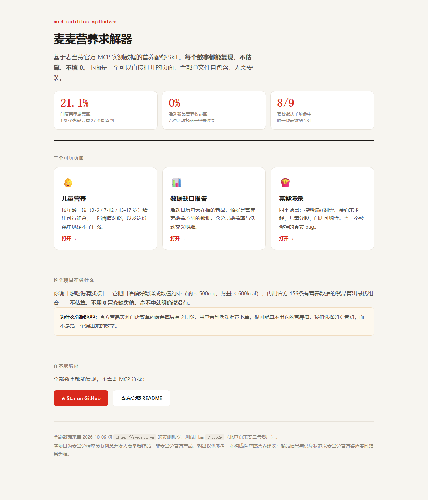
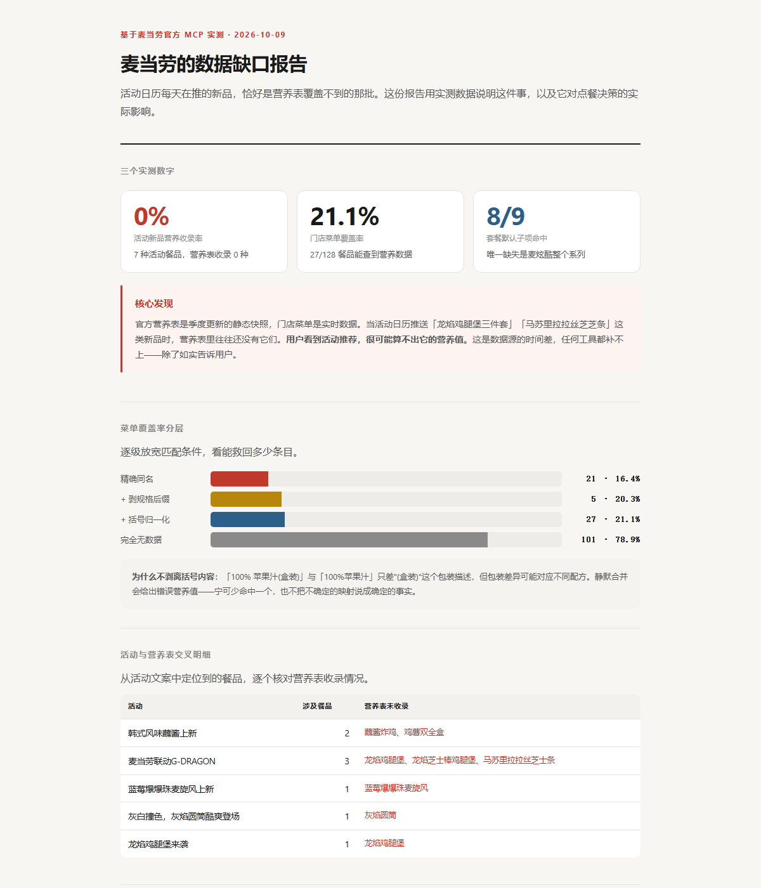

# 麦麦营养求解器

> 「我想吃得清淡点」——不用你懂营养学，它知道换成多少毫克钠。

基于麦当劳官方 MCP 实测数据的营养配餐 Skill。**每个数字都能复现，不估算、不填 0。**



🌐 **[在线演示（免安装，浏览器直接打开）→](https://hxxcb1412.github.io/mcd-nutrition-optimizer/)**

[](https://github.com/Hxxcb1412/mcd-nutrition-optimizer) [](https://hxxcb1412.github.io/mcd-nutrition-optimizer/) [](https://github.com/Hxxcb1412/mcd-nutrition-optimizer/blob/main/LICENSE) [](https://github.com/Hxxcb1412/mcd-nutrition-optimizer)

**三个页面，浏览器直接打开，无需安装、无需 Token：**

| 页面 | 内容 |
|---|---|
| [👶 儿童营养](https://hxxcb1412.github.io/mcd-nutrition-optimizer/child-nutrition.html) | 按年龄三段给出可行组合，并报告菜单缺口 |
| [📊 数据缺口报告](https://hxxcb1412.github.io/mcd-nutrition-optimizer/data-gap-report.html) | 活动新品 vs 营养表覆盖，0% 收录率的实测依据 |
| [🍟 完整演示](https://hxxcb1412.github.io/mcd-nutrition-optimizer/demo.html) | 四个场景 + 三个被修掉的真实 bug |

---

## 🔍 核心能力：下单前告诉你这份方案算不算得清

用户准备下单时，先判断哪些营养结论算得出来。三种结论：

| 结论 | 含义 | 行为 |
|---|---|---|
| 完整可信 | 全部餐品有营养数据 | 正常输出合计 |
| **部分可信** | 部分能算 | **拒绝输出部分和** |
| 无法计算 | 关键项缺失 | 直接说算不出，不估算 |

```
你：这个龙焰鸡腿堡三件套活动看着不错，帮我算算钠

它：【部分可信】
    [缺数据] 龙焰鸡腿堡三件套 —— 官方营养表未收录
    [可算]   中薯条  289kcal · 钠 165mg
    [可算]   可乐中杯 147kcal · 钠 0mg

    为什么不输出合计：漏掉的三件套会让总热量被低估，
    你以为这单更健康。实测活动新品的营养收录率是 0%。

    如果想知道确切数字，请以麦当劳官方营养标示为准。
```

**两种缺失要分开说**：「纯悦」是**占位记录**（表里有，热量与蛋白同时为 0），
「龙焰鸡腿堡」是**根本没收录**。前者是数据缺失，后者是营养表滞后于菜单。

---

## 👶 孩子吃什么，这是给家长的答案

输入年龄，直接看到该年龄段的可行组合、三档阈值对照，以及**这份菜单满足不了什么**。

**🎬 [打开儿童营养页 →](docs/child-nutrition.html)** （浏览器直接打开，不需要 Token）

```
你：我家 7 岁孩子，吃麦当劳要注意什么？

它：按学龄儿童（7-12 岁）的参考标准：热量 550–750 kcal、
    钠 ≤ 1000 mg、脂肪 ≤ 25 g。这是通用膳食参考值，
    不是医疗建议，也不能替代儿科医生的意见。

    ◆ 大杯玉米杯 + ○ 热奶铁中杯 + ● 麦乐鸡4块
      562 kcal · 蛋白 10g · 钠 337 mg

    顺便说一件事：实测麦当劳 17% 的餐品钠含量超过 800mg，
    孩子常吃的汉堡类普遍在 500-1000mg。这是数据事实。
```

**为什么这件事值得单独做**：家长最容易被"儿童套餐"四个字糊弄过去。
我们把年龄段阈值、数据来源、以及菜单的缺口都摆在明面上。

---

## 📊 另一个 nobody else 做的事

**活动日历每天在推的新品，恰好是营养表覆盖不到的那批。**

**🎬 [打开数据缺口报告 →](https://hxxcb1412.github.io/mcd-nutrition-optimizer/data-gap-report.html)**



实测结果：

| 指标 | 数值 |
|---|---|
| 活动新品的营养收录率 | **0%**（7 种活动餐品，一条都没收录） |
| 门店菜单覆盖率 | **21.1%**（128 个餐品只有 27 个能查到） |
| 套餐默认子项命中 | **8/9**（唯一缺的是麦炫酷整个系列） |

你看到"龙焰鸡腿堡三件套 26.9 元"的活动推荐时，很可能算不出它的营养值。
**这是数据源的时间差，不是工具能补的**——我们选择如实告诉你。

---

## 快速开始

```bash
git clone https://github.com/Hxxcb1412/mcd-nutrition-optimizer
cd mcd-nutrition-optimizer

# 三个网页，直接双击打开，零依赖
open docs/child-nutrition.html      # 儿童营养
open docs/data-gap-report.html      # 数据缺口报告
open docs/demo.html                 # 完整演示

# 跑测试验证每个数字
python scripts/smoke_test.py        # 24 项，README 数字均可复现
python scripts/test_precheck.py       # 58 项，预检/账本+边界
python scripts/test_solver.py       # 19 项
```

配置 MCP 后可接入真实数据（申请 Token：[open.mcd.cn/mcp](https://open.mcd.cn/mcp)）：

```json
{
  "mcdServers": {
    "mcd-mcp": {
      "type": "streamablehttp",
      "url": "https://mcp.mcd.cn",
      "headers": { "Authorization": "Bearer ${MCD_MCP_TOKEN}" }
    }
  }
}
```

装成 Skill 后直接说人话：

> 想吃得清淡点 · 500 大卡以内的午餐 · 巨无霸三件套多少大卡 · 我家 7 岁孩子吃什么

---

## 三个真实 bug，都是数据抓出来才发现的

不是测试假设出来的，是实测数据暴露的。

**1. 无糖可乐差点以「0 大卡 2mg 钠」成为最优解。**
营养表有 4 条记录热量与蛋白质同时为 0，判据写成"四个字段全为 0"时，
无糖可乐的碳水是 **1** 不是 0，于是被当成真实数据。

**2.「清淡午餐」收敛到三样饮品。**
纯按钠排序时，最优解是「冰美式 + 可乐 + 纯牛奶」——钠最低但只有 8g 蛋白。
根因是低钠食物全在奶品类，而正餐类钠普遍 500-1000mg。

**3. 给 4 岁孩子推荐了汽水加牛奶。**
关键词表里「纯牛奶」含"牛"、「热浓浓抹茶牛奶」含"蛋"（浓**蛋**绿），
都先命中了"蛋白"类，于是「可乐 + 纯牛奶」通过了"必须含主食或蛋白"的校验。
**这个 bug 在成人场景只是荒谬，在儿童场景是严重不当。**

---

## 我们的立场

**不用 0 冒充没有数据。** 遇到营养表没收录的餐品，明确说"没有"，
而不是估一个数字。遇到套餐子项缺数据，**拒绝输出部分和**——
强行求和会漏掉那一项，热量明显低估，那比不给数字更糟。

**不迎合你。** 要求「钠 ≤ 300mg 的午餐」时，我们会告诉你：
麦当劳没有低钠正餐，蛋白质 ≥5g 的餐品里钠最低的是优品豆浆（32mg），
再往下全是饮品和奶品。

**不上手花钱。** 只调用 7 个只读 MCP 工具，不下单不领券不改账户。

> 想看完整技术细节、接口陷阱、算法设计与全部实测数据？
> **[→ 技术文档](docs/technical.md)**

---

**⭐ 觉得有用的话，点个 Star。** 本项目参加麦当劳程序员节创意开发大赛，
排名看 Star 数。觉得数据缺口报告有用的话，转发给更多人。

---

本项目为参赛作品，非麦当劳官方产品。输出仅供参考，不构成医疗或营养建议。
餐品信息与供应状态以麦当劳官方渠道实时结果为准。数据为 2026-10-09 实测快照。
